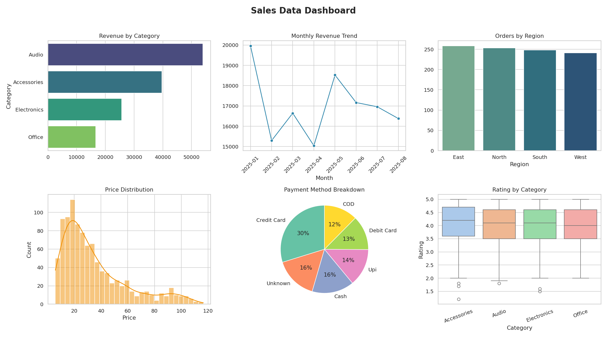

# Data Cleaning & Visualization Project

**Internship Task 1** — Work on a raw dataset to clean, process, and visualize insights.

## 📌 Overview

This project simulates a real-world e-commerce sales dataset with common data quality
problems (missing values, duplicates, outliers, inconsistent formatting) and walks through
a complete pipeline to clean it, then generate a set of visual reports/dashboards to surface
key business insights.

## 📂 Project Structure

```
data-cleaning-viz-project/
├── data/
│   ├── raw_sales_data.csv          # Raw, messy dataset (1045 rows)
│   ├── cleaned_sales_data.csv      # Cleaned, analysis-ready dataset (1000 rows)
│   └── cleaning_log.txt            # Log of every cleaning step + row counts
├── notebooks/
│   └── data_cleaning_visualization.ipynb   # Full walkthrough notebook (with outputs)
├── scripts/
│   ├── generate_raw_data.py        # Generates the synthetic raw dataset
│   ├── clean_data.py               # Cleaning pipeline (reusable function)
│   └── visualize.py                # Generates all charts + combined dashboard
├── images/
│   ├── dashboard.png               # Combined 6-panel dashboard
│   ├── revenue_by_category.png
│   ├── monthly_revenue_trend.png
│   ├── orders_by_region.png
│   ├── price_distribution.png
│   ├── payment_method_breakdown.png
│   └── rating_by_category.png
├── requirements.txt
└── README.md
```

## 🧹 Data Quality Issues Handled

| Issue | How it was handled |
|---|---|
| Missing values (Price, Age, Payment, Rating) | Group-wise median imputation / `'Unknown'` category |
| Fully empty rows | Dropped |
| Exact duplicate rows & duplicate OrderIDs | Dropped, keeping first occurrence |
| Inconsistent text casing/whitespace (`" North"`, `"south"`, `"EAST"`) | Trimmed + standardized to Title Case |
| Mixed date formats (`YYYY-MM-DD` vs `DD/MM/YYYY`) | Parsed into a single `datetime` column |
| Invalid/negative/zero prices & quantities | Treated as missing, then imputed |
| Extreme price outliers | Detected via IQR method, capped/imputed |

**Result:** 1045 raw rows → **1000 clean rows, 0 missing values.**

## 📊 Key Insights

- Audio products drive the highest total revenue despite fewer SKUs than Accessories.
- Monthly revenue is volatile rather than steadily trending — likely promotion/seasonality driven.
- Orders are fairly evenly split across regions (East slightly ahead).
- Credit Card is the most common payment method (~30% of orders).
- Rating distributions are consistent across categories (median ~4.0–4.2).



## 🛠️ Tech Stack

- **Python 3**
- **Pandas** — data cleaning & manipulation
- **NumPy** — numerical operations
- **Matplotlib / Seaborn** — visualization

## ▶️ How to Run

```bash
# 1. Clone the repo
git clone <your-repo-url>
cd data-cleaning-viz-project

# 2. Install dependencies
pip install -r requirements.txt

# 3. (Optional) Regenerate the raw dataset
python scripts/generate_raw_data.py

# 4. Run the cleaning pipeline
python scripts/clean_data.py

# 5. Generate visualizations
python scripts/visualize.py

# Or explore everything interactively:
jupyter notebook notebooks/data_cleaning_visualization.ipynb
```

## 🎯 Outcome

This project demonstrates an end-to-end data preprocessing and visualization workflow —
identifying and fixing common real-world data quality issues, then communicating findings
through clear, well-designed charts and a summary dashboard.
