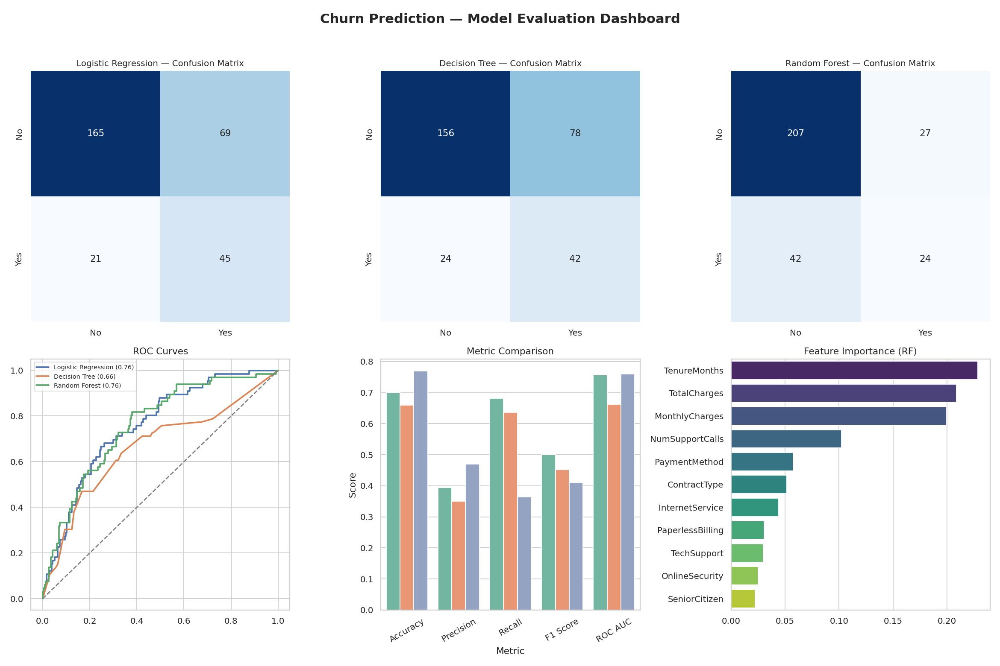

# Predictive Modeling Using Machine Learning

**Internship Task 2** — Build a model to predict outcomes based on given data.

## 📌 Overview

This project builds a **customer churn prediction** model for a subscription-based service.
Using customer account and usage data, it predicts whether a customer will churn (leave)
or stay, comparing three classification algorithms and evaluating them with industry-standard
metrics and visualizations.

## 📂 Project Structure

```
task-2-predictive-modeling/
├── data/
│   ├── raw_customer_data.csv         # Raw dataset (1515 rows, incl. duplicates/missing)
│   └── model_comparison_results.csv  # Final metric comparison table
├── notebooks/
│   └── predictive_modeling.ipynb     # Full walkthrough notebook (with outputs)
├── scripts/
│   ├── generate_data.py              # Generates the synthetic customer dataset
│   ├── train_models.py               # Preprocessing + training pipeline (reusable)
│   └── visualize_results.py          # Generates all evaluation charts + dashboard
├── images/
│   ├── dashboard.png                 # Combined evaluation dashboard
│   ├── confusion_matrices.png
│   ├── roc_curves.png
│   ├── model_comparison.png
│   └── feature_importance.png
├── requirements.txt
└── README.md
```

## 🎯 Problem

**Target:** `Churn` (binary — 1 = customer left, 0 = customer stayed)

**Features used:**
`SeniorCitizen`, `TenureMonths`, `ContractType`, `InternetService`, `TechSupport`,
`OnlineSecurity`, `PaperlessBilling`, `PaymentMethod`, `NumSupportCalls`,
`MonthlyCharges`, `TotalCharges`

## 🧹 Preprocessing

- Removed duplicate customer records
- Imputed missing `TotalCharges` with the median
- Label-encoded categorical features
- Stratified 80/20 train-test split (preserves churn ratio in both sets)
- Standardized features for Logistic Regression
- Used `class_weight='balanced'` across all models to handle the ~22% churn class imbalance

## 🤖 Models Trained & Compared

| Model | Accuracy | Precision | Recall | F1 Score | ROC AUC |
|---|---|---|---|---|---|
| Logistic Regression | 0.70 | 0.39 | 0.68 | 0.50 | **0.76** |
| Decision Tree | 0.66 | 0.35 | 0.64 | 0.45 | 0.66 |
| Random Forest | **0.77** | **0.47** | 0.36 | 0.41 | **0.76** |

*(exact numbers may vary slightly on re-run due to randomness; see `data/model_comparison_results.csv` for the latest run)*



## 📊 Key Insights

- **Random Forest** gives the best overall accuracy/precision, while **Logistic Regression**
  achieves the best recall — useful if the business priority is catching as many at-risk
  customers as possible, even at the cost of some false positives.
- **Tenure, Total Charges, and Monthly Charges** are the top three predictive features —
  newer, higher-paying customers are the most likely to churn.
- Month-to-month contracts and frequent support calls also increase churn risk.
- Handling class imbalance (`class_weight='balanced'`) was essential — without it, models
  collapsed to predicting "no churn" for nearly everyone.

## 🛠️ Tech Stack

- **Python 3**
- **Pandas / NumPy** — data handling
- **Scikit-learn** — Logistic Regression, Decision Tree, Random Forest, metrics
- **Matplotlib / Seaborn** — visualization

## ▶️ How to Run

```bash
cd task-2-predictive-modeling
pip install -r requirements.txt

# 1. (Optional) Regenerate the raw dataset
python scripts/generate_data.py

# 2. Train & evaluate all models
python scripts/train_models.py

# 3. Generate evaluation visualizations
python scripts/visualize_results.py

# Or explore everything interactively:
jupyter notebook notebooks/predictive_modeling.ipynb
```

## 🎯 Outcome

This project demonstrates a complete supervised learning workflow: preprocessing raw data,
training and tuning multiple classification algorithms, and rigorously evaluating and
comparing them using confusion matrices, ROC curves, and standard classification metrics.
