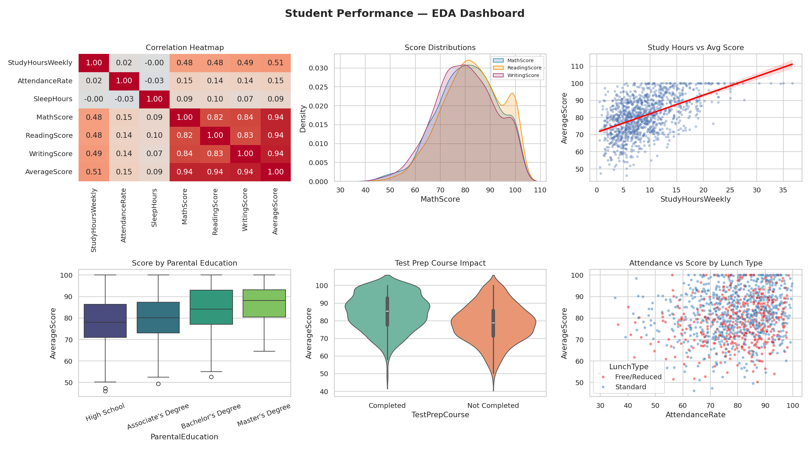

# Exploratory Data Analysis (EDA) Project

**Internship Task 3** — Analyze a dataset to uncover patterns and trends.

## 📌 Overview

This project performs a full exploratory data analysis on a **student performance dataset**,
examining how study habits, background factors, and school-related variables relate to
academic outcomes across Math, Reading, and Writing scores.

## 📂 Project Structure

```
task-3-eda-project/
├── data/
│   ├── student_performance.csv       # Dataset (1200 students, 13 columns)
│   ├── statistical_summary.csv       # Full describe() output
│   └── correlation_matrix.csv        # Correlation matrix of numeric features
├── notebooks/
│   └── eda_analysis.ipynb            # Full walkthrough notebook (with outputs)
├── scripts/
│   ├── generate_data.py              # Generates the synthetic dataset
│   └── eda_analysis.py               # Runs the full EDA + saves all charts
├── images/
│   ├── dashboard.png                 # Combined 6-panel EDA dashboard
│   ├── correlation_heatmap.png
│   ├── score_distributions.png
│   ├── study_hours_vs_score.png
│   ├── score_by_parental_education.png
│   ├── test_prep_impact.png
│   └── attendance_vs_score.png
├── requirements.txt
└── README.md
```

## 🔎 Dataset

1200 students with the following fields: `Gender`, `ParentalEducation`, `LunchType`,
`TestPrepCourse`, `StudyHoursWeekly`, `AttendanceRate`, `ExtracurricularActivity`,
`SleepHours`, `MathScore`, `ReadingScore`, `WritingScore`, `AverageScore`.

## 📊 Key Findings

- **Subject scores are highly correlated with each other** (r ≈ 0.82–0.84) — students strong
  in one subject tend to be strong across the board, validating `AverageScore` as a summary metric.
- **Study hours is the strongest behavioral predictor** of performance (r ≈ 0.51).
- **Parental education level** shows a clear gradient: average scores rise from **78.2**
  (High School) to **86.7** (Master's Degree).
- **Completing a test-prep course adds ~6.3 points on average** (84.8 vs 78.5) — the single
  largest *actionable* factor identified.
- **Lunch type** (a socioeconomic proxy) also correlates with performance: 82.4 (Standard)
  vs 78.9 (Free/Reduced).
- **Attendance rate and sleep hours show only weak correlation** with scores (r ≈ 0.15 and 0.09) —
  consistent effort matters more than mere presence or rest, in this dataset.

**Recommendation:** Prioritizing test-prep access and structured study habits appears to be
the most actionable lever for improving outcomes, more so than attendance-focused policies alone.



## 🛠️ Tech Stack

- **Python 3**
- **Pandas / NumPy** — statistical summaries & correlation analysis
- **Matplotlib / Seaborn** — distribution plots, heatmaps, box/violin plots

## ▶️ How to Run

```bash
cd task-3-eda-project
pip install -r requirements.txt

# 1. (Optional) Regenerate the dataset
python scripts/generate_data.py

# 2. Run the full EDA (produces stats + all charts)
python scripts/eda_analysis.py

# Or explore everything interactively:
jupyter notebook notebooks/eda_analysis.ipynb
```

## 🎯 Outcome

This project demonstrates core EDA skills: statistical summarization, distribution analysis,
correlation analysis, and translating visual patterns into clear, actionable insights.
