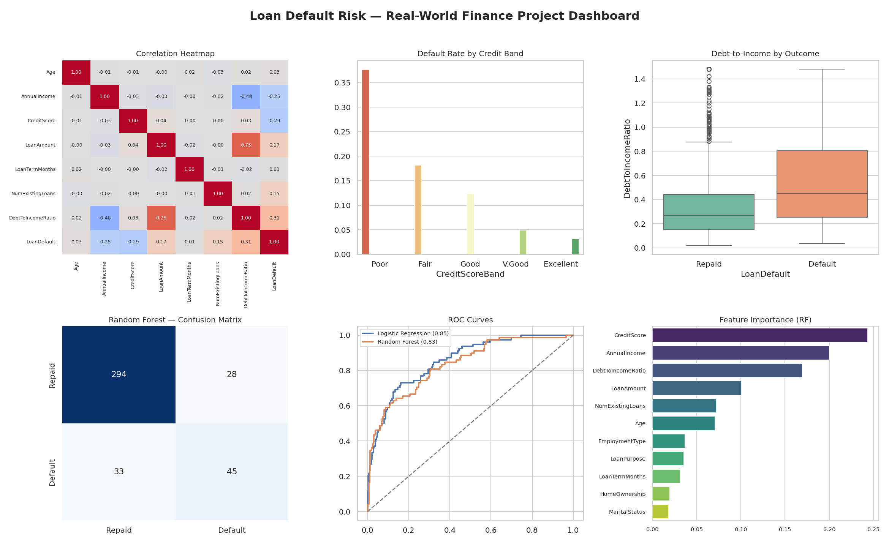

# Real-World Data Project — Finance: Loan Default Risk

**Internship Task 4** — Work on a domain-specific dataset for applied learning.

## 📌 Overview

This is a capstone project applying the full data science workflow — cleaning, EDA, and
predictive modeling — to a **finance** use case: predicting whether a loan applicant is
likely to **default** based on their financial and demographic profile.

## 📂 Project Structure

```
task-4-finance-loan-default/
├── data/
│   ├── raw_loan_data.csv           # Raw dataset (2020 rows, incl. duplicates/missing)
│   ├── cleaned_loan_data.csv       # Cleaned, analysis-ready dataset (2000 rows)
│   ├── cleaning_log.txt            # Log of cleaning steps
│   ├── correlation_matrix.csv      # Correlation of numeric features with default
│   └── model_results.csv           # Final model comparison metrics
├── notebooks/
│   └── loan_default_analysis.ipynb # Full end-to-end walkthrough (with outputs)
├── scripts/
│   ├── generate_data.py            # Generates the synthetic raw dataset
│   ├── clean_data.py               # Cleaning pipeline
│   ├── eda.py                      # Exploratory analysis + charts
│   ├── train_model.py              # Model training, evaluation, and metrics
│   └── dashboard.py                # Combined summary dashboard
├── images/
│   ├── dashboard.png               # Combined 6-panel dashboard (EDA + model results)
│   ├── correlation_heatmap.png
│   ├── default_rate_by_credit_band.png
│   ├── dti_by_outcome.png
│   ├── default_rate_by_employment.png
│   ├── income_distribution_by_outcome.png
│   ├── confusion_matrices.png
│   ├── roc_curves.png
│   └── feature_importance.png
├── requirements.txt
└── README.md
```

## 🎯 Problem

**Target:** `LoanDefault` (binary — 1 = defaulted, 0 = repaid)

**Domain fields:** `Age`, `AnnualIncome`, `EmploymentType`, `CreditScore`, `LoanAmount`,
`LoanTermMonths`, `NumExistingLoans`, `HomeOwnership`, `MaritalStatus`, `LoanPurpose`,
`DebtToIncomeRatio`

## 🧹 Data Cleaning

- Removed duplicate applicant records
- Imputed missing `CreditScore` with the median
- Imputed missing `AnnualIncome` with the group median by employment type
- Capped extreme `DebtToIncomeRatio` outliers using the IQR method

**Result:** 2020 raw rows → **2000 clean rows, 0 missing values.**

## 📊 Key Findings

- **Credit score and debt-to-income ratio are the strongest predictors of default**, confirmed
  by both correlation analysis and Random Forest feature importance.
- Applicants with **"Poor" credit (<580) default at ~38%**, vs. just **~3% for "Excellent" credit**
  — over a 10x difference in risk.
- **Debt-to-income ratio strongly separates outcomes**: defaulters carry roughly double the
  median DTI of applicants who repaid.
- Unemployed and self-employed applicants show elevated default rates compared to salaried applicants.

## 🤖 Model Results

| Model | Accuracy | Precision | Recall | F1 Score | ROC AUC |
|---|---|---|---|---|---|
| Logistic Regression | 0.75 | 0.42 | **0.74** | 0.54 | **0.85** |
| Random Forest | **0.85** | **0.62** | 0.58 | **0.60** | 0.83 |

*(see `data/model_results.csv` for the latest run — numbers may vary slightly on re-run due to randomness)*



### Business Recommendation
Use **credit score band and debt-to-income ratio as primary underwriting signals**. Random
Forest offers higher precision (fewer false declines) while Logistic Regression offers higher
recall (catches more true defaulters) — the right model depends on whether the lender prioritizes
approval rate or risk minimization. A practical approach: use the model score to flag borderline
applications for manual underwriting review rather than fully automated decisions.

## 🛠️ Tech Stack

- **Python 3**
- **Pandas / NumPy** — data cleaning & analysis
- **Scikit-learn** — Logistic Regression, Random Forest, evaluation metrics
- **Matplotlib / Seaborn** — visualization

## ▶️ How to Run

```bash
cd task-4-finance-loan-default
pip install -r requirements.txt

python scripts/generate_data.py    # (optional) regenerate raw data
python scripts/clean_data.py       # clean the data
python scripts/eda.py              # run EDA + save charts
python scripts/train_model.py      # train models + evaluate
python scripts/dashboard.py        # generate combined dashboard

# Or explore everything interactively:
jupyter notebook notebooks/loan_default_analysis.ipynb
```

## 🎯 Outcome

This project demonstrates the ability to apply data science skills end-to-end in a real-world
domain context — from raw, messy data through cleaning, exploratory analysis, predictive
modeling, and translating results into actionable business recommendations.
